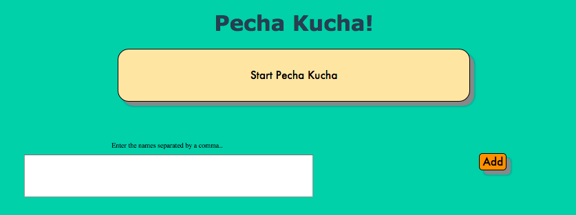

## Pecha Kucha

###What is that?
Pecha Kucha is a presentation of a story, displayed in 20 slides, lasting 20 seconds each slide.
this is an application for randomly choosing a next person to do a Pecha Kucha presentation for our friday session at Makers Academy.

After we done, we celebrate!

Technologies used
--

- Ruby
- Sinatra
- HTML & CSS

Collaborators
--
- [Sanda Golcea](https://github.com/sandagolcea)
- [Jin Dai](https://github.com/jindai1783)
- [Matteo Manzo](https://github.com/matteomanzo)
